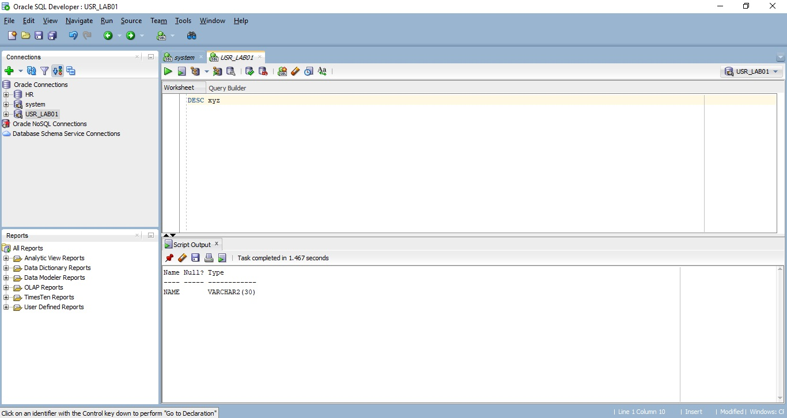
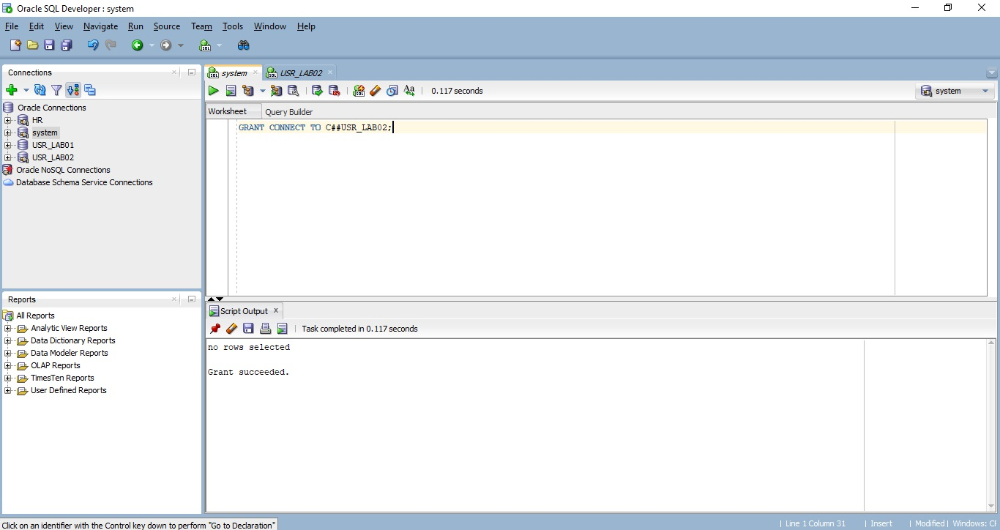

# Relatório Laboratório 01

## Comando, Evidência e Resposta
------------------------
------------------------
### Comando 01

```sql
SELECT * FROM v$version;
```
**Evidência:**


***Pergunta:*** Qual a finalidade da visão v$version?

***Resposta:*** Exibe os números de versão dos componentes principais da biblioteca no banco de dados Oracle. Existe uma linha para cada componente.

------------------------
------------------------
### Comando 02

```sql
SELECT username FROM dba_users;
```
**Evidência:**


***Pergunta:*** Qual a finalidade da visão dba_users?

***Resposta:*** Descreve todos os usuários do banco de dados.

------------------------
------------------------
### Comando 03

```sql
CREATE USER USR_LAB01 IDENTIFIED BY SENHA;
```
**Evidência:**


***Nota:*** Foi utilizado "C##" antes do nome por ter causado erro na execução do comando, por se tratar de um usuário comum.

------------------------
------------------------
### Comando 04

```sql
GRANT CONNECT, RESOURCE to USR_LAB01;
```
**Evidência:**


***Pergunta:*** Qual finalidade das roles connect e resource?

***Resposta:*** Com a função CONNECT, o usuário poderá realizar as funções: Alterar sessão; Criar cluster; Criar link de banco de dados; Criar sequência; Criar sessão; Criar sinônimo; Criar a tabela; Criar vista. Já a função RESOURCE inclui o Create type, privilégio do sistema.

------------------------
------------------------
### Comando 05

**Evidência:**


***Pergunta:*** abra outra janela e conecte com o usuário criado acima. Foi possível conectar?

***Resposta:*** Foi possível.

------------------------
------------------------
### Comando 06

```sql
ALTER USER USR_LAB01 IDENTIFIED BY new_password;
```

**Evidência:**


------------------------
------------------------
### Comando 07

```sql
SELECT TABLE_NAME FROM ALL_TABLES;
```

**Evidência:**


------------------------
------------------------
### Comando 08

```sql
SHOW USER;
CREATE TABLE xyz (name VARCHAR2(30));
CREATE TABLE USR_LAB01.xyz (name VARCHAR2(30));
```

**Evidência:**
- O comando foi executado, sendo o primeiro CREATE TABLE criando a tabela xyz para o usuário system e, na segunda situação, foi criado para o USR_LAB01.

------------------------
------------------------
### Comando 09

```sql
DESC xyz
```

**Evidência:**


------------------------
------------------------
### Comando 10

```sql
DESC system.xyz
```

**Evidência:**


***Pergunta:*** Esse comando funcionou? O que falta ao usuário USR_LAB01 para que esse comando funcione?

***Resposta:*** O comando não funcionou. O que está faltando é o acesso à tabela xyz do usuário system.

------------------------
------------------------
### Comando 11

```sql
CREATE USER USR_LAB02 IDENTIFIED BY SENHA;
GRANT INSERT, DELETE, SELECT ON USR_LAB01.XYZ TO USR_LAB02;
```

**Evidência:**


***Pergunta:*** Que operação está acontecendo aqui?

***Resposta:*** Está sendo criado o novo usuário USR_LAB02 e está recebendo as permissões para inserir, deletar e pesquisar dados na tabela XYZ do usuario USR_LAB01.

------------------------
------------------------
### Comando 12

```sql
GRANT CONNECT TO USR_LAB02;
```

**Evidência:**


------------------------
------------------------
### Comando 13

```sql
SELECT * FROM dba_tab_privs WHERE grantee = 'USR_LAB02';
```

**Evidência:**


***Pergunta:*** Qual o significado do resultado dessa consulta?

***Resposta:*** Descreve as concessões de objetos para as quais o usuário atual é o proprietário, concessor ou concessionário do objeto.

------------------------
------------------------
### Comando 14

```sql
INSERT INTO usr_lab01.xyz VALUES ('teste de nome');
COMMIT;
SELECT * FROM usr_lab01.xyz;
```

**Evidência:**


***Pergunta:*** Explique por que ele funcionou.

***Resposta:*** O insert não funcionou por falta de privilégios.

------------------------
------------------------
### Comando 15

```sql
SELECT * FROM system.xyz;
```

**Evidência:**


***Pergunta:*** Explique por que ele NÃO funcionou.

***Resposta:*** Porque não existe a tabela xyz no system.

------------------------
------------------------
### Comando 16

```sql
SELECT * FROM xyz;
```

**Evidência:**


***Pergunta:*** Explique por que ele NÃO funcionou.

***Resposta:*** Porque não existe a tabela xyz no USR_LAB02.

------------------------
------------------------
### Comando 17

```sql
CREATE ROLE new_dba;
GRANT CONNECT TO new_dba;
GRANT SELECT ANY TABLE TO new_dba;
GRANT select_catalog_role TO new_dba;
GRANT new_dba TO USR_LAB01;
```

**Evidência:**


***Pergunta:*** Explique como foi o processo de atribuição do privilégio ao usuário usr_lab01 que permitiu a ele acessa a tabela.

***Resposta:*** Basicamente os 3 privilégios são para conexão, consulta e para ter acesso a tabelas como dba_sys_privs.

------------------------

