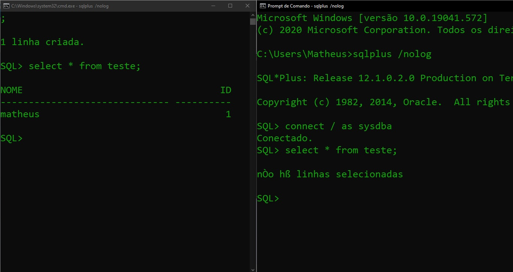

C:> SQLPlus /nolog (Explicar o que significa o comando) 

Com esse comando o usuário se conectará ao SQLPlus sem login.

-------------

Conectar como usuário do banco de dados 

-------------------

Inserir uma linha numa tabela desse usuário sem executar commit. 

Abrir outra janela com o SQLPlus e conectar com um usuário. 

Executar uma consulta que tente recuperar a linha inserida acima. 

Documente o que aconteceu e explique. 

Como é possível ver, sem executar o commit a segunda tela não tem acesso aos dados inseridos na tabela de teste. Esse fenômeno ocorre porque ao não executar o commit os dados ficam em memória mas não gravados no disco, dessa forma, o segundo usuário conectado não tem acesso aos dados.

----------------

Execute o COMMIT na primeira janela. Documente e explique (D & E - Documente & Explique). 

Repetir a consulta da linha inserida. (D & E) 

Ao executar o commit, os dados serão armazenados no disco e, dessa forma, o segundo usuário terá acesso aos dados inseridos na tabela.

-----------------

Na primeira janela, execute um UPDATE na linha inserida. 

Na segunda janela, execute outro UPDATE na mesma linha. (D & E) 

Após ter sido feito o update na tabela de teste pelo usuário 1, foi tentado realizar a mesma operação com o usuário 2 e ele fica no aguardo e, se houver interrupção enquanto o usuário 1 não der o commit, o update do usuário 2 não será executado.

-----------------

Faça o COMMIT na Janela 01. (D & E)

Após ter sido executado o commit, o prompt do segundo usuário poderá ser interrompido para executar o comando.