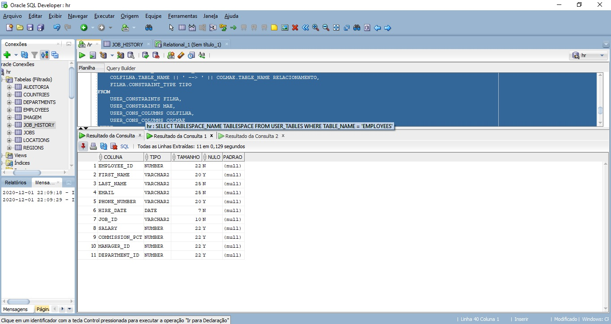
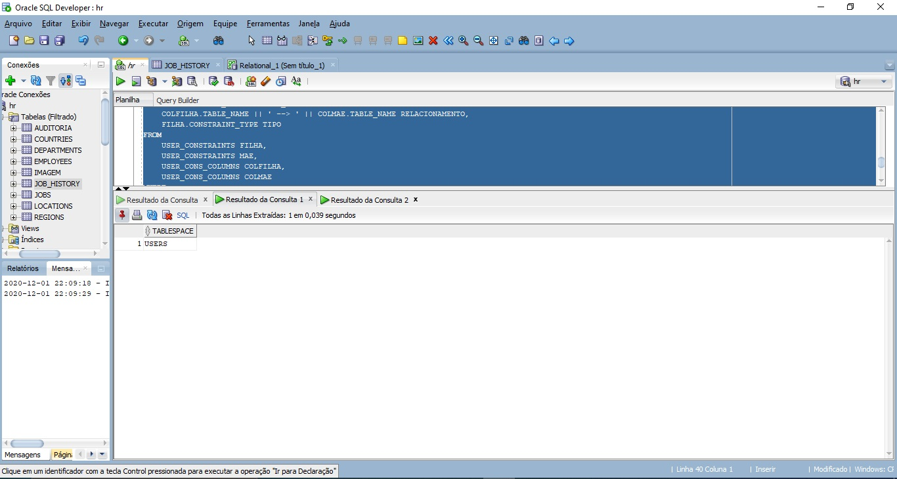
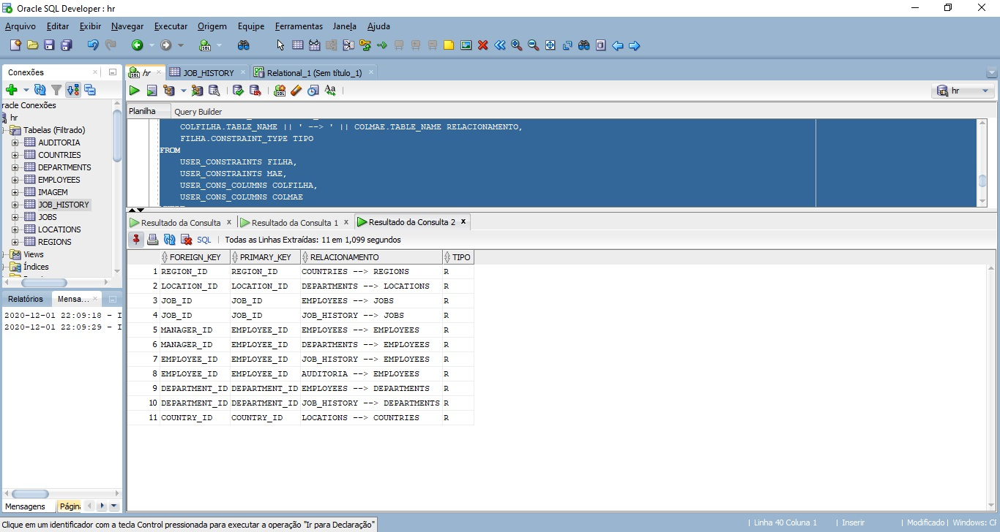

```sql
/* -------------------------------------------------------------------- */
/* SELECT PARA BUSCAR A COLUNA, O TIPO, TAMANHO, SE É NULO E SEU PADRAO */
SELECT
    C.COLUMN_NAME COLUNA,
    C.DATA_TYPE TIPO,
    C.DATA_LENGTH TAMANHO,
    C.NULLABLE NULO,
    C.DATA_DEFAULT PADRAO
FROM
    USER_TAB_COLUMNS C
WHERE
    C.TABLE_NAME = 'EMPLOYEES';

/* --------------------------------------------------------------- */
/* SELECT PARA BUSCAR A TABLESPACE EM QUE A TABELA ESTÁ ARMAZENADA */
SELECT
    TABLESPACE_NAME TABLESPACE
FROM
    USER_TABLES
WHERE
    TABLE_NAME = 'EMPLOYEES';

/* ------------------------------------------------------------ */
/* SELECT PARA BUSCAR AS CHAVES ESTRANGEIRAS E SUAS REFERENCIAS */
SELECT 
    COLFILHA.COLUMN_NAME FOREIGN_KEY,
    COLMAE.COLUMN_NAME PRIMARY_KEY,
    COLFILHA.TABLE_NAME || ' --> ' || COLMAE.TABLE_NAME RELACIONAMENTO,
    FILHA.CONSTRAINT_TYPE TIPO
FROM 
    USER_CONSTRAINTS FILHA, 
    USER_CONSTRAINTS MAE,
    USER_CONS_COLUMNS COLFILHA,
    USER_CONS_COLUMNS COLMAE
WHERE 
    FILHA.R_OWNER = MAE.OWNER AND 
    FILHA.R_CONSTRAINT_NAME = MAE.CONSTRAINT_NAME AND 
    FILHA.CONSTRAINT_NAME = COLFILHA.CONSTRAINT_NAME AND
    MAE.CONSTRAINT_NAME = COLMAE.CONSTRAINT_NAME;
```






